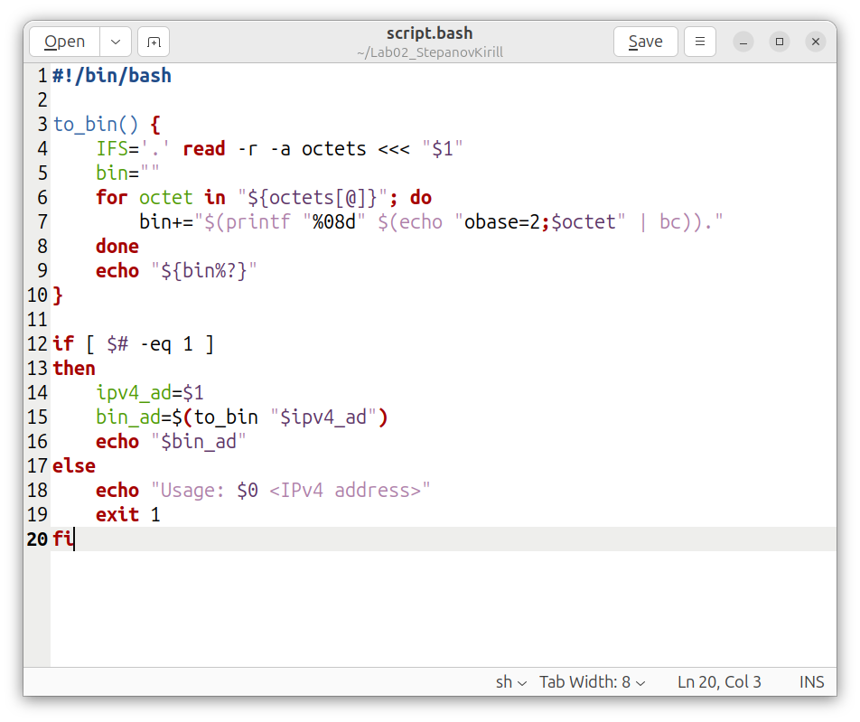
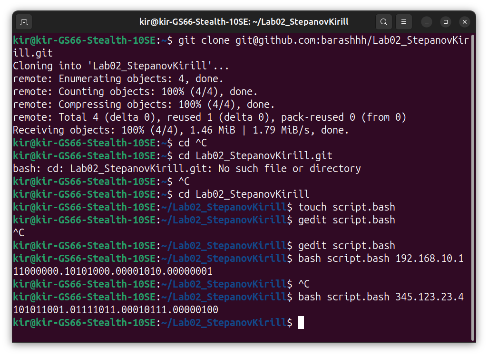

#Отчет по лабороторной работе 2 by Stepanov Kirill  
Цель: написать скрипт, получающий на вход IPV4 адрес, который потом идет в бинарном представлении.
Пишем функцию to_bin() которая будет принимать строку, представляющую собой IPv4-адрес, и преобразовывает его в двоичное представление  
Рассмотрим ее подробнее:  
IFS (Internal Field Separator) задает сепаратор точку, по которой мы будем разбивать строку на океты  
С помощью read читаем строку, -r отвечает за игнорирование обратных слэшей, -a ocets записывает все в массив  
<<< "$1" сама поступающая строка пользователя  
далее мы делаем стандартный цикл, который будет делать преобразования  
Переменная bin будет использоваться для накопления двоичных значений каждого октета.  
Команда printf "%08d" гарантирует, что двоичное значение будет состоять из 8 символов, добавляя нули в начале, если необходимо
echo "obase=2;$octet" | bc переводит элемент массива в двоичный вид
Потом идет просто вывод того, что получилось
If просто проверяет, сколько аргументов подается на вход. Если их больше одно,то завершиаемся с ошибкой, если нет, то вызовется функция.  
Сам код:

Тест на выход результатов:

